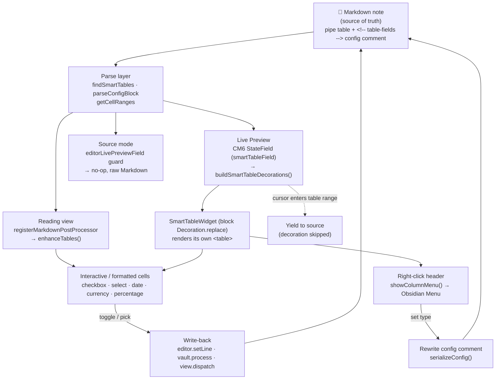

# Table Fields — Engineering

> How typed, interactive columns are layered onto a plain Markdown pipe table without ever leaving
> plain Markdown. Single-file plugin (`main.js`), plain JS, no build step.

**English** · [中文](ENGINEERING.zh-CN.md) — [‹ User README](README.md)

## Architecture

The Markdown note is the **single source of truth**. Nothing is stored outside it — configuration
lives in an HTML comment directly above each table, and every edit is written straight back into the
pipe table. Three render surfaces read the same source; only Live Preview replaces the rendering.

## How the features work

### Config as an adjacent HTML comment
Each smart table is declared by a `<!-- table-fields id="…" v="1" cols: … -->` comment immediately
above the pipe table. `findSmartTables()` scans the doc for these, pairs each with the table below
it (skipping blank lines), and records the comment's line span, the header line, and the last data
row. `parseConfigBlock()` turns the comment body into `{ id, version, cols[] }`. A table with **no**
comment is never touched.

### Reading view — markdown post-processor
`registerMarkdownPostProcessor` fires per rendered block. `enhanceTables()` calls
`ctx.getSectionInfo(el)` to recover the table's **source line range**, matches the config, then
rewrites each `<td>` into a control (`enhanceCell`). This is the low-risk path and works in both
Reading view and inactive Live Preview blocks.

### Live Preview — CodeMirror 6 state field
Obsidian renders Live Preview tables with its own CM6 extension, so a post-processor can't reach
them. Instead, `smartTableField` (a `StateField`) computes a `DecorationSet`:

- For each table whose source range the cursor is **outside**, it adds a **block**
  `Decoration.replace({ widget, block: true })` spanning the config comment + table lines, rendering
  a `SmartTableWidget` (our own interactive `<table>`).
- When the selection intersects a table's range, that table is **skipped** → Obsidian shows raw
  source so the user can edit it directly. This is the deliberate "controls when idle, source when
  editing" behavior.
- `editorLivePreviewField` gates the whole thing off in Source mode.

Block-spanning replacements must come from a `StateField` (a view plugin throws on line-break
replacement), which is why this is a field, not a view plugin.

### Write-back to the exact source range
Cell offsets are computed by `getCellRanges()` (character ranges between pipes). Editing a control
replaces exactly that range:

- Live Preview widget → `view.dispatch({ changes: { from, to, insert } })` (`dispatchCell`).
- Reading view → the active `MarkdownView` editor's `setLine`, or `vault.process` as a fallback.

Values are stored canonically (`[x]`/`[ ]`, ISO dates, plain numbers, `NN%`); formatting is
display-only.

### Right-click column typing
`SmartTableWidget.showColumnMenu()` opens an Obsidian `Menu` on header right-click. Choosing a type
rebuilds the config object and writes it back with `serializeConfig()` over the comment's source
range — no settings UI, no sidebar.

### The "mark table" command
`markTableAsSmart()` finds the table around the cursor, infers each column's type from a sample row
(`inferType`: checkbox / date / percentage / currency / text), and inserts a ready-made config
comment.

## Key modules (all in `main.js`)

| Symbol | Responsibility |
| --- | --- |
| `parseConfigBlock` / `serializeConfig` | Parse ⇄ serialize the `<!-- table-fields … -->` comment |
| `findConfigForTable` / `findSmartTables` | Locate config for a table (reading view / whole-doc scan) |
| `getCellRanges` | Character offsets of each cell (between pipes) — the basis of write-back |
| `enhanceTables` / `enhanceCell` | Reading-view rendering + controls |
| `smartTableField` / `buildSmartTableDecorations` | Live Preview CM6 decorations |
| `SmartTableWidget` | The block widget: renders the interactive table + right-click menu |
| `renderWidgetCell` / `dispatchCell` | Live Preview cell controls + write-back |
| `MarkdownSmartTablesPlugin` | `onload`: registers post-processor, editor extension, command |

## Extending it

- **New column type:** add a `case` in both `enhanceCell` (reading) and `renderWidgetCell` (LP);
  add it to the `types` list in `showColumnMenu` and to `inferType` if it should be auto-detected.
- **New right-click action** (add/delete row, edit options, sort): add a `menu.addItem` in
  `showColumnMenu` (or a cell-level `contextmenu`), compute the target source range from
  `getCellRanges` / the table's line span, and `view.dispatch` the text edit. Everything is a source
  transform — no new storage.

## Dev & build

- **No bundler.** `require("obsidian")` and `require("@codemirror/*")` resolve to Obsidian's bundled
  copies at runtime — never bundle your own copies or the CM6 classes won't match.
- Ship `main.js`, `manifest.json`, `styles.css`, `versions.json`.
- Syntax check: `node --check main.js`.

## Testing

Pure logic (config parsing, pipe-cell range replacement, load/wiring) is verified with an offline
Node harness that stubs the `obsidian` module — no Obsidian GUI needed. The CM6 Live Preview path
and the post-processor path are verified manually in Obsidian against the example note.
