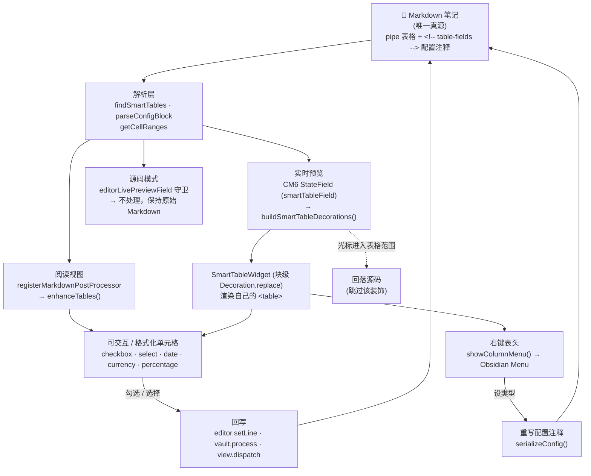

# Table Fields — 工程文档

> 如何在**不脱离纯 Markdown** 的前提下，为一张普通 pipe 表格叠加"有类型、可交互"的列。
> 单文件插件（`main.js`），纯 JS，免构建。

[English](ENGINEERING.md) · **中文** — [‹ 用户 README](README.zh-CN.md)

## 架构

Markdown 笔记是**唯一真源**。没有任何东西存在笔记之外——配置就在每张表上方的 HTML 注释里，每次编辑都
直接写回 pipe 表格。三个渲染面读的是同一份源码，只有实时预览会替换渲染。

## 各功能如何实现

### 配置 = 相邻的 HTML 注释
每张智能表由紧贴其上方的 `<!-- table-fields id="…" v="1" cols: … -->` 注释声明。`findSmartTables()`
扫全文找这些注释，把每个注释和它下方的表格配对（跳过空行），记录注释行区间、表头行、最后一行数据。
`parseConfigBlock()` 把注释体解析成 `{ id, version, cols[] }`。**没有**注释的表格永不被接管。

### 阅读视图 —— markdown 后处理器
`registerMarkdownPostProcessor` 按渲染块触发。`enhanceTables()` 用 `ctx.getSectionInfo(el)` 取回
表格的**源码行区间**，匹配配置，然后把每个 `<td>` 改写成控件（`enhanceCell`）。这是低风险路径，
阅读视图和"非活动的"实时预览块都走它。

### 实时预览 —— CodeMirror 6 状态字段
Obsidian 用自己的 CM6 扩展渲染实时预览里的表格，后处理器够不着它。于是用 `smartTableField`
（一个 `StateField`）计算 `DecorationSet`：

- 对每张"光标不在其源码范围内"的表格，加一个**块级** `Decoration.replace({ widget, block: true })`，
  覆盖配置注释 + 表格行，渲染一个 `SmartTableWidget`（我们自己的可交互 `<table>`）。
- 当选区与某表范围相交，就**跳过**该表 → Obsidian 显示原始源码，让用户直接编辑。这就是刻意设计的
  "空闲时给控件、编辑时给源码"。
- `editorLivePreviewField` 在源码模式下整体关闭它。

跨行的替换装饰必须由 `StateField` 提供（view plugin 对跨换行替换会抛错），所以这里用 field 而非
view plugin。

### 回写到精确的源码区间
单元格偏移由 `getCellRanges()` 计算（两个竖线之间的字符区间）。编辑控件时精确替换该区间：

- 实时预览 widget → `view.dispatch({ changes: { from, to, insert } })`（`dispatchCell`）。
- 阅读视图 → 当前 `MarkdownView` 编辑器的 `setLine`，或退回 `vault.process`。

值以规范形存储（`[x]`/`[ ]`、ISO 日期、纯数字、`NN%`）；格式化只在显示层。

### 右键设列类型
`SmartTableWidget.showColumnMenu()` 在右键表头时弹出 Obsidian `Menu`。选一个类型就重建配置对象，
用 `serializeConfig()` 覆盖注释所在源码区间——无设置界面、无侧栏。

### "标记表格"命令
`markTableAsSmart()` 找到光标周围的表格，从一行样本数据推断每列类型（`inferType`：checkbox / date /
percentage / currency / text），插入一段现成的配置注释。

## 关键模块（全在 `main.js`）

| 符号 | 职责 |
| --- | --- |
| `parseConfigBlock` / `serializeConfig` | 解析 ⇄ 序列化 `<!-- table-fields … -->` 注释 |
| `findConfigForTable` / `findSmartTables` | 为表格定位配置（阅读视图 / 全文扫描） |
| `getCellRanges` | 每个单元格的字符偏移（竖线之间）——回写的基础 |
| `enhanceTables` / `enhanceCell` | 阅读视图渲染 + 控件 |
| `smartTableField` / `buildSmartTableDecorations` | 实时预览的 CM6 装饰 |
| `SmartTableWidget` | 块级 widget：渲染可交互表格 + 右键菜单 |
| `renderWidgetCell` / `dispatchCell` | 实时预览单元格控件 + 回写 |
| `MarkdownSmartTablesPlugin` | `onload`：注册后处理器、编辑器扩展、命令 |

## 如何扩展

- **新列类型：** 在 `enhanceCell`（阅读）和 `renderWidgetCell`（实时预览）各加一个 `case`；把它加进
  `showColumnMenu` 的 `types` 列表，如需自动识别再加进 `inferType`。
- **新右键动作**（增删行、编辑选项、排序）：在 `showColumnMenu` 里加 `menu.addItem`（或在单元格上加
  `contextmenu`），用 `getCellRanges` / 表格行区间算出目标源码区间，再 `view.dispatch` 做文本编辑。
  一切都是源码文本变换——无需新存储。

## 开发与构建

- **免打包。** `require("obsidian")` 和 `require("@codemirror/*")` 在运行时解析到 Obsidian 自带的
  副本——千万别自己打包 CM6，否则类不匹配、扩展失效。
- 发布 `main.js`、`manifest.json`、`styles.css`、`versions.json`。
- 语法检查：`node --check main.js`。

## 测试

纯逻辑（配置解析、pipe 单元格区间替换、加载/接线）用一套离线 Node 测试验证——stub 掉 `obsidian` 模块，
不需要 Obsidian 图形界面。CM6 实时预览路径和后处理器路径在 Obsidian 里对着示例笔记手动验证。
