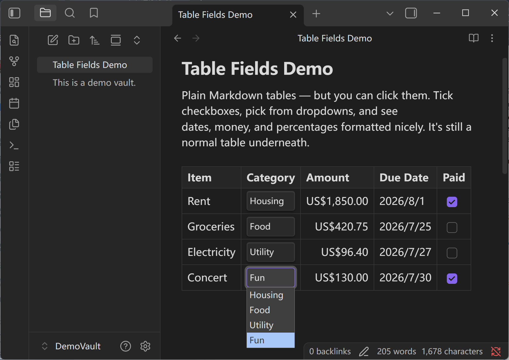
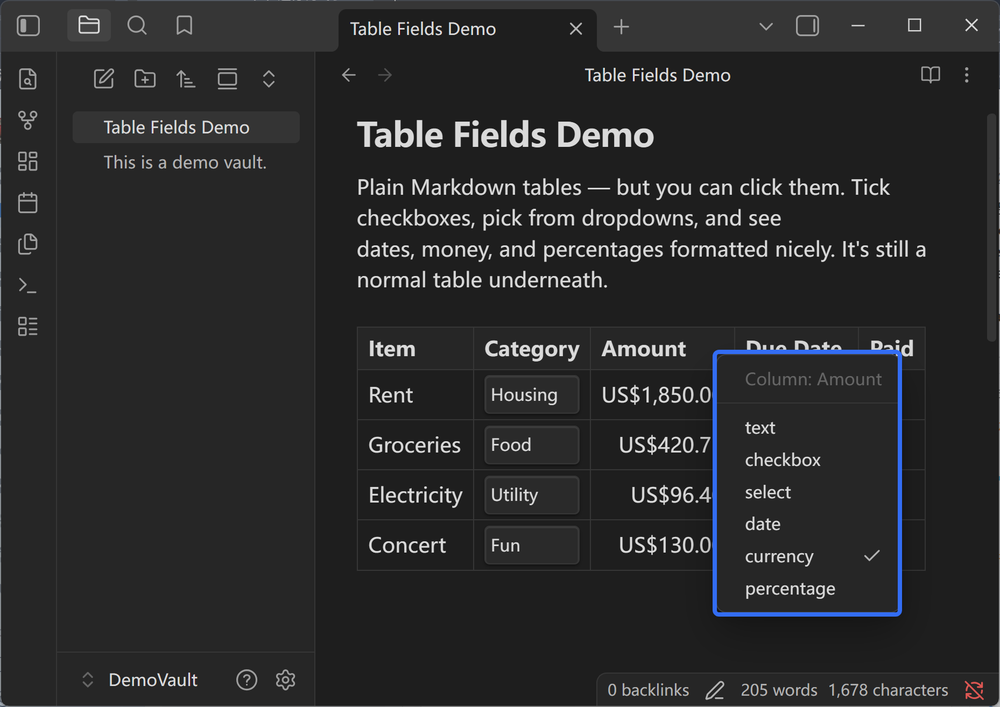
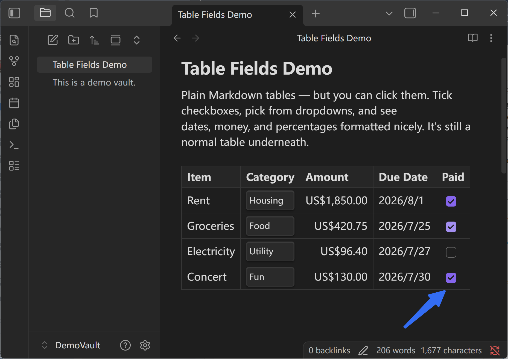
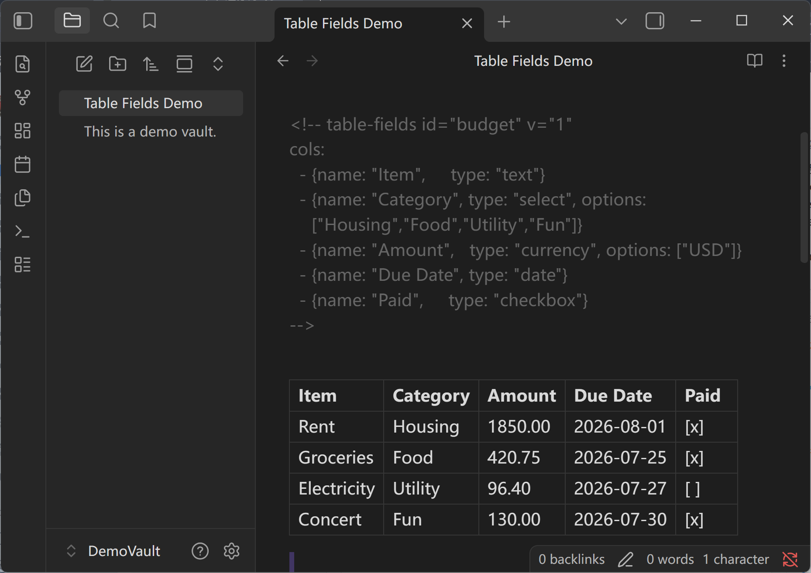

# Table Fields

> Your Markdown tables, but you can actually **click** them — tick checkboxes, pick from
> dropdowns, and see dates and money formatted nicely — all inside your note.

**English** · [中文](README.zh-CN.md) — [Engineering ›](ENGINEERING.md)

Table Fields gives each **column a meaning**. Tell it "this column is a checkbox", "this one is a
status dropdown", "this one is money" — and your plain table turns into something you can operate
like a tiny spreadsheet. And here's the promise: **underneath, it's still just a normal Markdown
table.** Turn the plugin off and your note is exactly as readable as before. No database, no hidden
file, no lock-in.



## What it does

- ☑️ **Checkboxes you can tick** — click to mark something done, right in the table.
- 🔽 **Dropdowns** — pick a status or category from a fixed list, so values never drift.
- 💲 **Money, %, and dates that look right** — amounts line up with a currency symbol, dates read in
  your local format, percentages align neatly.
- 🖱️ **Right-click a column to set what it is** — no settings screen to hunt through.
- 👀 **Works while you read *and* while you edit** — the controls show up in both modes.
- 🧹 **Nothing locked in** — it's always a plain Markdown table on disk.

## See it

You write (or generate) a small note like this:

```markdown
<!-- table-fields id="tasks" v="1"
cols:
  - {name: "Task",   type: "text"}
  - {name: "Status", type: "select", options: ["Todo","Doing","Done"]}
  - {name: "Due",    type: "date"}
  - {name: "Done",   type: "checkbox"}
-->
| Task           | Status | Due        | Done |
| -------------- | ------ | ---------- | ---- |
| Draft PRD      | Doing  | 2026-07-22 | [x]  |
| Review designs | Todo   | 2026-07-24 | [ ]  |
```

…and in your note it becomes a table where **Status** is a dropdown, **Due** shows a tidy date, and
**Done** is a real checkbox you can click. Tick it, and the change is saved straight into the table.





## Why it's different

- **It's not a database.** Tools like Obsidian Bases turn every row into a separate note. Table
  Fields keeps everything in *one table in one note*.
- **It's not a separate spreadsheet.** Other table tools store your data as a block of code you can
  no longer read. Table Fields never does that — it stays a plain table.
- **Disable it anytime.** Your note is still a clean, readable Markdown table. You never lose your
  data or your ability to read it in any other app.



## Quick start

1. Write a normal Markdown table.
2. Put your cursor in it and run the command **"Table Fields: Mark table under cursor as Table
   Fields"** — it looks at your data and sets up the columns for you.
3. Want to change a column? **Right-click its header** and pick the type (text, checkbox, dropdown,
   date, money, or percent).

That's it. Click your checkboxes and dropdowns; everything saves back into the note automatically.

## Features, one by one

- **Checkbox columns** — turn a column of `done / not done` into clickable boxes.
- **Dropdown (select) columns** — give a column a fixed set of choices (like *Todo / Doing / Done*)
  so everyone uses the same words.
- **Money columns** — type a plain number; it's shown with a currency symbol and lined up on the
  right.
- **Percent columns** — kept as simple `60%` text, aligned for easy scanning.
- **Date columns** — stored in a standard form, shown in your local date style.
- **Right-click setup** — change any column's type from the table itself, no config screen needed.

## Good to know

- Your values stay as **plain, readable text** — dates as `2026-07-22`, money as `1200.00`. The
  pretty formatting is only on screen.
- There are **no formulas** — this is on purpose. Table Fields is for light structure, not for
  turning your note into Excel.
- **Coming next:** right-click to add or remove rows and columns, edit dropdown choices, and sort.

## Install (for now)

Table Fields isn't in the community store yet. To try it:

1. Copy this folder into `<your vault>/.obsidian/plugins/table-fields/`.
2. In Obsidian: **Settings → Community plugins → enable Table Fields**.
3. Open a note with a `table-fields` table (there's an example note in this repo's history).

---

Curious how it works under the hood? See the **[Engineering README ›](ENGINEERING.md)**.
