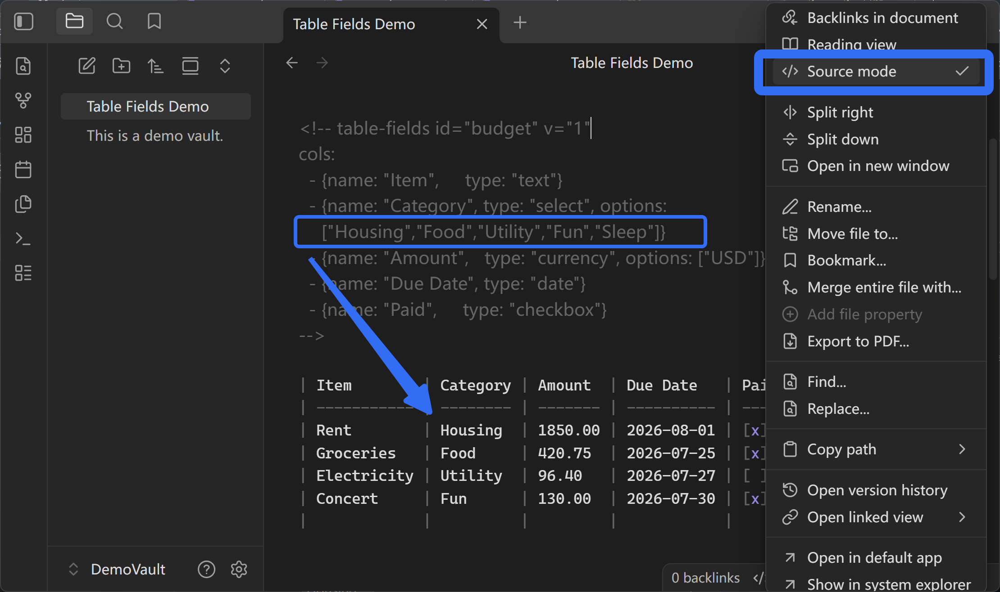
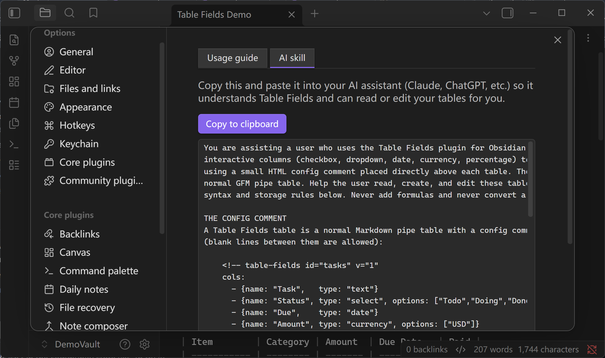

# Table Fields

> 还是你的 Markdown 表格，但现在你能**点**它了——勾选复选框、从下拉里选、日期和金额也显示得清清爽爽，
> 全都在你的笔记里完成。

[English](README.md) · **中文** — [工程文档 ›](ENGINEERING.zh-CN.md)

Table Fields 给每一**列一个含义**。告诉它"这列是复选框""这列是状态下拉""这列是金额"，你那张普通表格
就变成了一个能像小型电子表格一样操作的东西。而关键承诺是：**底层它依然只是一张普通的 Markdown 表格**。
关掉插件，你的笔记和原来一样清爽可读。没有数据库、没有隐藏文件、不绑架你的数据。

## 下拉、日期、金额和复选框直接在笔记里渲染


- ☑️ **能点的复选框**——直接在表格里点一下标记完成。
- 🔽 **下拉选择**——从固定选项里选状态或分类，取值不会再乱飘。
- 💲 **金额、百分比、日期都显示得体**——金额带货币符号右对齐，日期按你本地格式，百分比对齐好看。
- 🖱️ **右键一列就能设定它是什么类型**——不用去翻设置页。
- 👀 **阅读时和编辑时都能用**——两种模式下控件都在。
- 🧹 **绝不绑架**——磁盘上永远是一张纯 Markdown 表格。

## 一小段注释就能给每列声明字段类型

你写（或让它生成）这样一小段笔记：

```markdown
<!-- table-fields id="tasks" v="1"
cols:
  - {name: "Task",   type: "text"}
  - {name: "Status", type: "select", options: ["Todo","Doing","Done"]}
  - {name: "Due",    type: "date"}
  - {name: "Done",   type: "checkbox"}
-->
| Task           | Status | Due        | Done |
| -------------- | ------ | ---------- | ---- |
| Draft PRD      | Doing  | 2026-07-22 | [x]  |
| Review designs | Todo   | 2026-07-24 | [ ]  |
```

……在笔记里它就变成一张表：**Status** 是下拉，**Due** 显示成整洁的日期，**Done** 是一个能点的真复选框。
点一下，改动就直接存回表格里。


## 下拉选项在 Source mode 里直接改

切到 **Source mode**，找到 `type: "select"` 的那一列，编辑它的 `options: [...]` 列表。改完切回阅读视图或
Live Preview，下拉列表就会使用这些选项。小提示：如果新选项没有立刻出现，退出这篇 note 再重新打开一次，
让渲染刷新。



## 勾选复选框会写回 Markdown 表格


## 关掉插件后仍然是可读的 Markdown 表格

- **它不是数据库。** 像 Obsidian Bases 那样会把每一行变成一篇独立笔记；Table Fields 让一切都留在
  *一篇笔记的一张表*里。
- **它不是另一个电子表格。** 有些表格工具把你的数据存成一段你再也看不懂的代码；Table Fields 从不这样，
  它始终是一张纯表格。
- **随时可以关。** 关掉后你的笔记仍是干净可读的 Markdown 表格，数据不丢，也能在任何别的 App 里读。


## 从任意普通 Markdown 表格开始

1. 写一张普通的 Markdown 表格。
2. 把光标放进去，运行命令 **"Table Fields: Mark table under cursor as Table Fields"**——它会看你的
   数据、自动把各列配好。
3. 想改某一列？**右键它的表头**，选类型（文本、复选框、下拉、日期、金额、百分比）。

就这样。点你的复选框和下拉，改动会自动存回笔记。

## 每种字段类型只整理一种值

- **复选框列**——把一列"完成 / 未完成"变成能点的方框。
- **下拉（select）列**——给一列一组固定选项（比如 *Todo / Doing / Done*），大家用词统一。
- **金额列**——你只填纯数字，显示时自动带货币符号并右对齐。
- **百分比列**——保持成简单的 `60%` 文本，对齐好扫读。
- **日期列**——按标准格式存储，按你本地日期风格显示。
- **右键设定**——直接在表格上改任意列的类型，不需要配置页。

## 让你的 AI 读写你的表格

Table Fields 内置了一段给 AI 的现成提示词。打开 **设置 → Table Fields → AI skill**，点
**Copy to clipboard**，粘贴给 Claude、ChatGPT 或任意助手——它就懂 Table Fields 的语法，能帮你读取、
新建、修改表格了。



## 隐私与收费

**免费，且完全本地。** Table Fields 只读写你自己笔记里的表格——没有任何数据离开你的设备，没有账号或
API key，开发者不收集任何东西。完整数据流见 **[PRIVACY.md](PRIVACY.md)**。

---

想知道它背后怎么实现的？看 **[工程文档 ›](ENGINEERING.zh-CN.md)**。
